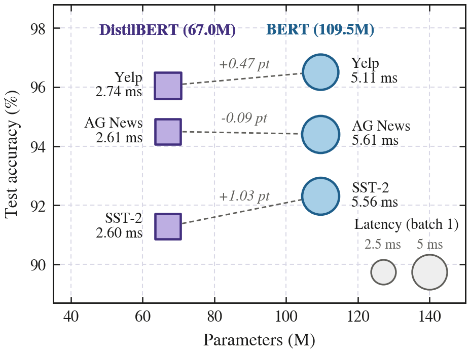
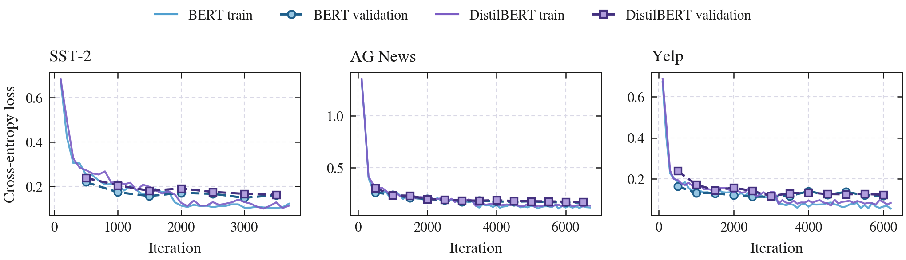
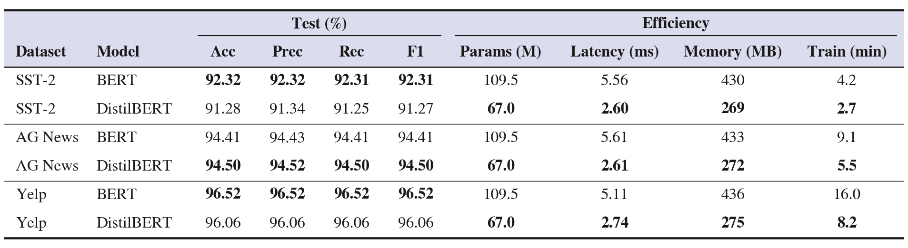
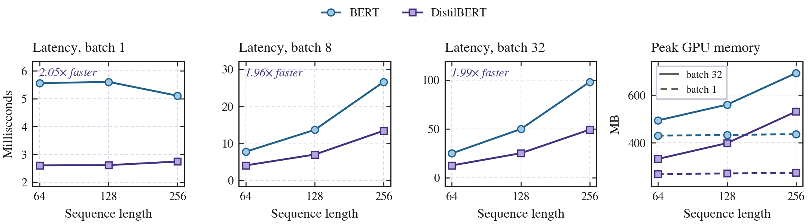
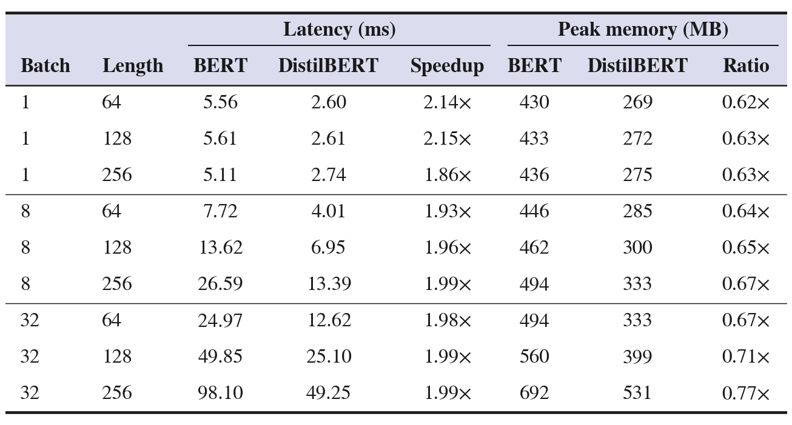
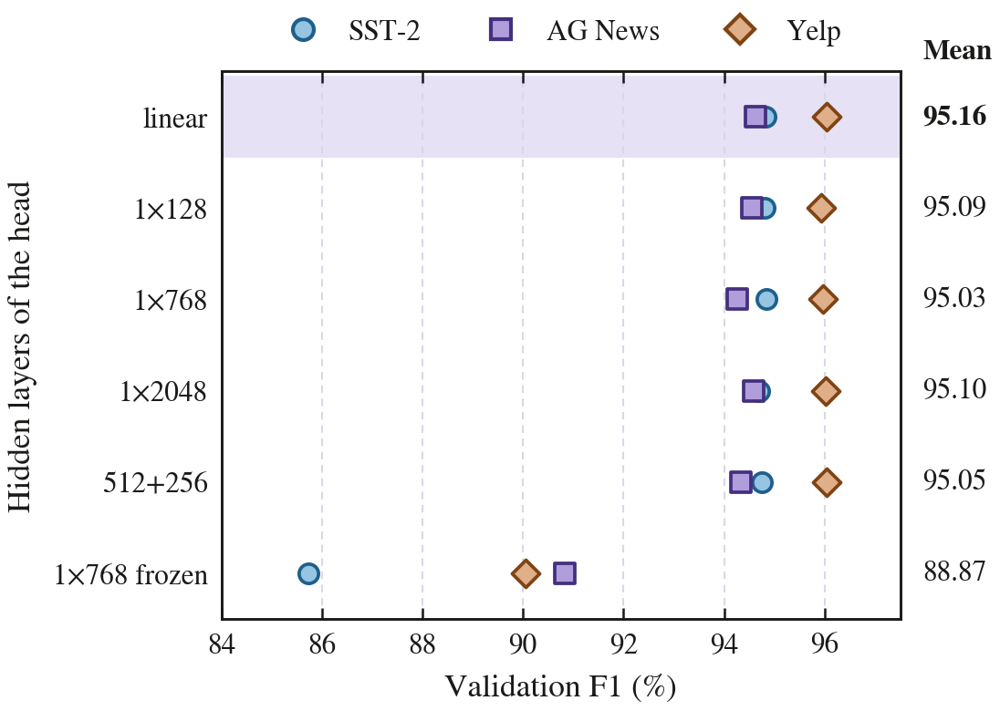
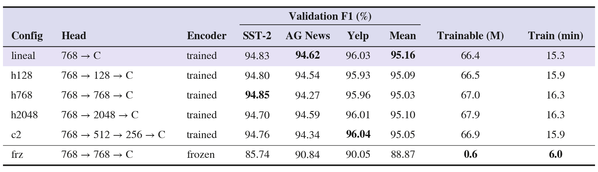
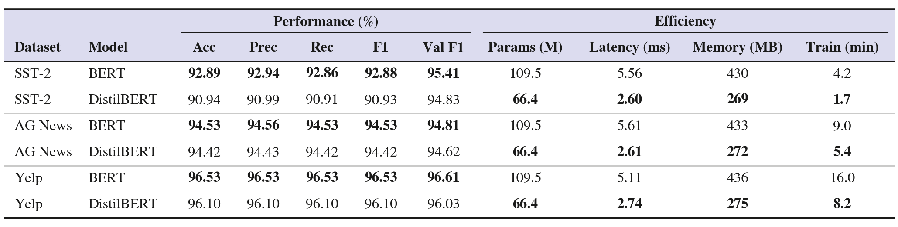
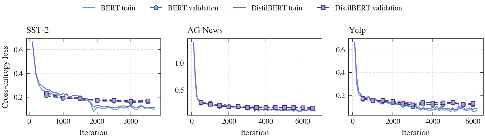

# DistilBERT vs BERT en clasificación de texto

Proyecto 1 del curso de NLP (UTEC). Hacemos fine-tuning de **BERT-base** y
**DistilBERT-base** sobre SST-2, AG News y Yelp Polarity con la misma receta,
medimos desempeño y eficiencia, y con un *ablation study* averiguamos qué
partes del clasificador pesan de verdad.



DistilBERT usa el 61 % de los parámetros de BERT. Conserva entre el 98,9 % y
el 99,5 % de su accuracy, y responde el doble de rápido en los nueve puntos de
la rejilla de latencia.

El informe técnico (4 páginas, template NeurIPS 2025, en inglés) está en
[`docs/informe/main.pdf`](docs/informe/main.pdf).

## Idea del repositorio

Todos los modelos y datasets pasan por un solo pipeline. Dos piezas de
adaptación lo hacen posible:

- `src/data_adapter.py` lleva los tres datasets a las mismas dos columnas
  (`text`, `label`) y a los mismos tres splits (`train` / `validation` /
  `test`). Ningún otro módulo sabe con qué dataset trabaja.
- `src/models.py` construye cualquier modelo a partir de un nombre corto
  (`bert`, `distilbert`) y de los pesos pre-entrenados de HuggingFace.

Cambiar de experimento es cambiar un argumento de la línea de comandos. Si dos
corridas difieren, la diferencia viene del modelo y del código no.

## Estructura

```
src/
  paths.py          rutas del repo, ancladas a la raiz
  data_adapter.py   carga y normaliza SST-2, AG News y Yelp
  models.py         fabrica de modelos, cabeza configurable y congelado
  train.py          bucle de fine-tuning (escrito a mano, sin Trainer)
  metrics.py        accuracy/precision/recall/F1 + latencia, memoria, tamano
  runs.py           consulta de las corridas guardadas
  style.py          paleta y estilo comun de figuras y tablas
  plots.py          figuras del informe (PDF + PNG)
  tables.py         tablas del informe (Markdown + PNG + LaTeX)
  benchmark.py      latencia y memoria en una rejilla controlada
scripts/
  train.sbatch      lanza un fine-tuning en un nodo GPU (Slurm)
  ablation.sbatch   las N configuraciones del ablation, en serie
  benchmark.sbatch  la medicion de eficiencia controlada
  launch_base.sh    los tres datasets de un modelo, de una vez
results/
  metrics/          un JSON por corrida (no se sobrescribe nada)
  figures/          figuras y tablas generadas por src/plots.py
  logs/             salida de los jobs de Slurm
docs/
  papers/           articulos de referencia
  informe/          informe en LaTeX, template NeurIPS 2025 (main.pdf)
requirements.txt    dependencias (torch aparte: depende de la CUDA local)
```

## Datasets

| Dataset | Fuente (HuggingFace) | Clases | Train / Val / Test | `max_length` |
|---|---|---|---|---|
| SST-2 | `nyu-mll/glue`, config `sst2` | 2 | 60.614 / 6.735 / 872 | 64 |
| AG News | `fancyzhx/ag_news` | 4 | 108.000 / 12.000 / 7.600 | 128 |
| Yelp Polarity | `fancyzhx/yelp_polarity` | 2 | 100.000\* / 20.000\* / 38.000 | 256 |

Dos decisiones cambian cómo se leen los resultados.

**El `test` de SST-2 no se usa.** GLUE lo publica sin etiquetas
(`label = -1`) porque la evaluación oficial se hace en su servidor. Usamos el
`validation` oficial (872 frases) como test y apartamos un 10 % del train
como validación, igual que la literatura, así que los números se pueden
comparar con los publicados.

**Yelp va submuestreado** (\*). Tomamos 100k de las 560k reseñas de train y
20k para validación. Con las 560k a 256 tokens el costo se multiplicaría por
cinco para ganar unas décimas de accuracy. Los dos modelos ven exactamente el
mismo subconjunto, con la misma semilla.

## Instalación

```bash
conda create -y -n nlp-p1 python=3.11
conda activate nlp-p1
pip install torch --index-url https://download.pytorch.org/whl/cu128   # ver nota
pip install -r requirements.txt
```

`torch` se instala aparte porque la rueda depende de la versión de CUDA de la
máquina y pip no la resuelve solo. En CPU basta con `pip install torch`.

Para **regenerar solo las figuras y las tablas** a partir de los JSON del repo
no hacen falta GPU ni torch:

```bash
pip install matplotlib numpy
python -m src.plots
```

Los datasets y los checkpoints se descargan solos la primera vez. En un
clúster cuyos nodos de cálculo no tienen internet hay que bajarlos antes desde
el nodo de login:

```bash
python -c "
from datasets import load_dataset
from transformers import AutoTokenizer, AutoModelForSequenceClassification
for hf_id, cfg in [('nyu-mll/glue','sst2'), ('fancyzhx/ag_news',None), ('fancyzhx/yelp_polarity',None)]:
    load_dataset(hf_id, cfg, cache_dir='data/raw')
for mid in ['distilbert-base-uncased','bert-base-uncased']:
    AutoTokenizer.from_pretrained(mid); AutoModelForSequenceClassification.from_pretrained(mid, num_labels=2)
"
```

## Uso

### Fine-tuning

```bash
# Un experimento concreto
python -m src.train --model distilbert --task sst2 --epochs 2 --tag base

# Yelp: se submuestrea para acotar el costo
python -m src.train --model distilbert --task yelp \
    --max-train 100000 --max-val 20000 --epochs 2 --tag base
```

Otros argumentos: `--batch-size`, `--lr`, `--max-length`, `--log-every`,
`--eval-every`, `--no-amp` (desactiva fp16) y `--tag` (etiqueta la corrida).
Cada ejecución escribe `results/metrics/<modelo>_<tarea>[_<tag>]_<fecha>.json`
con las métricas, la configuración y el historial de loss. Ninguna corrida
sobrescribe a otra.

**Convención de etiquetas.** Como nada se borra, la etiqueta es lo único que
separa una corrida del informe de una prueba. Las figuras y las tablas
descartan `smoke` y `pilot` (ver `TAGS_DESCARTADOS` en `src/runs.py`):

| Tag | Qué es |
|---|---|
| `base` | corrida del informe, protocolo completo |
| `abl-<config>` | una configuración del ablation study |
| `smoke` | prueba rápida de que el pipeline arranca |
| `pilot` | exploratoria, con el train submuestreado |

Una corrida exploratoria etiquetada como definitiva acaba en el informe sin
que nadie lo note, así que la convención importa.

### En un clúster con Slurm

```bash
sbatch scripts/train.sbatch --model distilbert --task sst2 --epochs 2 --tag base
bash scripts/launch_base.sh distilbert     # los tres datasets de una vez
```

### Figuras y tablas

```bash
python -m src.plots               # results/figures/
python -m src.runs                # tabla resumen de todas las corridas
```

Cada figura sale en **PDF** (vectorial, para el informe) y en **PNG** (lo que
GitHub muestra en este README). Cada tabla sale en tres formatos generados
desde una sola especificación en `src/tables.py`: **Markdown** para diffs,
**PNG** con estilo para este README y un `tabular` de **LaTeX** que el informe
incluye tal cual. Ninguna cifra del informe se copia a mano.

El estilo visual sigue a las figuras y tablas de *ChangeTitans* (IEEE TGRS
2025): letra con serifa, ejes en caja con ticks hacia dentro, burbujas en tono
pastel con borde oscuro, cabecera de tabla sombreada y la configuración
elegida en una franja lila. La paleta (morado, azul, ámbar) pasó el validador
de daltonismo del skill de visualización, y cada serie lleva además forma de
marcador y etiqueta propias.

## Protocolo de entrenamiento

Los dos modelos comparten exactamente esta receta:

| | |
|---|---|
| Optimizador | AdamW, `lr = 2e-5`, `weight_decay = 0.01` (sin decay en bias ni LayerNorm) |
| Scheduler | warmup lineal 10 % + decaimiento lineal |
| Épocas / batch | 2 / 32 |
| Precisión | fp16 (AMP) |
| Clipping | norma máxima 1.0 |
| Selección | se conserva el checkpoint con mejor F1 de **validación**; el test se toca una sola vez |
| Semilla | 42 en Python, NumPy y PyTorch |

Latencia y memoria se miden en la misma GPU (NVIDIA RTX A6000), con warm-up
previo y `torch.cuda.synchronize()`. Sin sincronizar, el cronómetro mide
cuánto tarda en encolarse la operación y se pierde su ejecución.

Las curvas de loss de las seis corridas base, un panel por dataset:



En SST-2 la loss de entrenamiento sigue bajando en la segunda época mientras
la de validación se queda cerca de 0,17. Por eso el checkpoint se elige por F1
de validación en vez de quedarse con el último. Las curvas de cada corrida por
separado están en `results/figures/curvas_<modelo>_<tarea>.png`.

## Resultados

### Desempeño y eficiencia (corridas base)

Mismo protocolo en las seis corridas: 2 épocas, batch 32, lr 2e-5, fp16, RTX
A6000. Precision, recall y F1 son macro. Latencia y memoria salen del
benchmark controlado, a batch 1 y con la longitud de secuencia de cada
dataset.



<sub>Versión en texto: [`tabla_resultados.md`](results/figures/tabla_resultados.md)</sub>

En SST-2 DistilBERT conserva el 98,9 % de la accuracy de BERT y en Yelp el
99,5 %. En AG News la diferencia cambia de signo (+0,09 puntos para
DistilBERT), pero con 7.600 ejemplos de test eso son 7 aciertos, un empate.
Clasificar temas de noticias no aprovecha las 6 capas extra. El análisis de
sentimiento de SST-2, con frases cortas llenas de negaciones y contrastes, sí
las aprovecha.

El 91,28 % de DistilBERT en SST-2 coincide con el 91,3 publicado por Sanh et
al., señal de que el protocolo está calibrado y de que no hay fugas entre
splits.

### Latencia y memoria en condiciones controladas

El campo `latencia_ms_media` que guarda cada corrida se mide con la longitud
de secuencia de *su* dataset y justo al terminar el entrenamiento, así que
esos números no se pueden comparar entre sí. BERT en SST-2 marcaba 3,16 ms y
DistilBERT 3,50 ms: el modelo con el doble de capas salía "más rápido". Para
las tablas usamos `src/benchmark.py`, que mide los dos modelos en la misma
rejilla de (batch, longitud), en la misma GPU y dentro del mismo proceso:

```bash
sbatch scripts/benchmark.sbatch      # o: python -m src.benchmark
```





<sub>Versión en texto: [`tabla_benchmark.md`](results/figures/tabla_benchmark.md)</sub>

DistilBERT es entre 1,86× y 2,15× más rápido en los nueve puntos, lo que se
espera al pasar de 12 capas a 6. Con batch 32 y 64 tokens procesa 2.535
muestras por segundo frente a 1.282.

**Con batch 1 la latencia no depende de la longitud.** BERT marca 5,56 / 5,61
/ 5,11 ms para 64 / 128 / 256 tokens y DistilBERT 2,60 / 2,61 / 2,74.
Cuadruplicar la longitud sale gratis porque la GPU pasa el tiempo esperando a
que se lancen los kernels. Desde batch 8 la latencia sigue a la longitud. La
ventaja de DistilBERT aparece en los dos regímenes por motivos distintos:
menos kernels que lanzar cuando se atiende una petición cada vez, y la mitad
de cálculo cuando se procesa por lotes.

El cociente de memoria pasa de 0,62× con batch 1 a 0,77× con batch 32 y 256
tokens, porque al crecer el lote las
activaciones, que dependen del batch y de la longitud, pesan más que los
pesos. Entrenar los tres datasets costó 16,4 minutos con DistilBERT y 29,3 con
BERT.

## Ablation study

Solo sobre DistilBERT. Cambiamos la cabeza de clasificación y qué parte del
transformer se entrena, con todo lo demás fijo. Son seis configuraciones en
tres datasets, 18 corridas:

| Config | Cabeza | Encoder | Eje que prueba |
|---|---|---|---|
| `lineal` | 768 → C | entrenable | menos capas (ninguna oculta) |
| `h128` | 768 → 128 → C | entrenable | menos neuronas |
| `h768` | 768 → 768 → C | entrenable | referencia |
| `h2048` | 768 → 2048 → C | entrenable | más neuronas |
| `c2` | 768 → 512 → 256 → C | entrenable | más capas |
| `frz` | 768 → 768 → C | **congelado** | congelar el transformer |

```bash
sbatch scripts/ablation.sbatch                  # las 6 configuraciones x 3 datasets
CONFIGS=4 sbatch scripts/ablation.sbatch        # version corta
TAREAS="sst2" sbatch scripts/ablation.sbatch    # un solo dataset
```

Es **un solo job de Slurm** que corre todo en serie. La QOS `a-pregrado`
admite una GPU a la vez y 3 jobs en cola, así que 18 jobs separados serían
rechazados.

En modo ablation el modelo es *encoder desnudo + cabeza propia*
(`ClasificadorConCabeza` en `src/models.py`), la misma para BERT y para
DistilBERT. La cabeza por defecto de HuggingFace cambia con la arquitectura:
BERT pasa por el pooler con `tanh` y DistilBERT por `pre_classifier` con
`ReLU`. Comparar cabezas montadas sobre preprocesos distintos mezclaría dos
variables en un experimento.

La configuración congelada entrena con `lr 1e-3` en vez de `2e-5`. Esa cabeza
se aprende desde cero y con 2e-5 apenas se movería. Sin el cambio,
`frz` perdería por el learning rate y el experimento dejaría de medir el
efecto de congelar.

### Resultado del ablation

La configuración se elige por **F1 de validación** promediado sobre los tres
datasets. El test solo se mira al final, una vez.





<sub>Versión en texto: [`tabla_ablation.md`](results/figures/tabla_ablation.md)</sub>

**La cabeza casi no cambia nada.** Las cinco configuraciones con el encoder
entrenable quedan entre 95,03 y 95,16 de F1 medio. Un clasificador lineal
empata con un MLP de 2048 neuronas y con uno de dos capas ocultas, y el orden
entre ellas cambia de un dataset a otro (`h768` es la mejor en SST-2 y la peor
en la media).

**Congelar el transformer sí pesa, y cuánto depende de la tarea.** Frente a
`h768`, que tiene la misma cabeza, el encoder congelado pierde 9,1 puntos de
F1 en SST-2, 5,9 en Yelp y 3,4 en AG News. Los temas de noticias se resuelven
casi con las características que DistilBERT trae de fábrica. El sentimiento
en frases cortas con negación y sarcasmo exige que el encoder se adapte. A
cambio, `frz` entrena 0,6 M de parámetros en 6 minutos.

Gana `lineal`. Su ventaja sobre las demás cabe en el ruido de una sola
semilla, y es además la más pequeña y la más rápida de entrenar, así que ante
el empate nos quedamos con ella.

### La mejor configuración, ahora con BERT

`lineal` (cabeza `Linear(768 → C)`, encoder entrenable) en los dos modelos,
con el mismo protocolo y los mismos datos, y todas las métricas:



<sub>Versión en texto: [`tabla_mejor_config.md`](results/figures/tabla_mejor_config.md)</sub>



Con la cabeza lineal BERT gana en los tres datasets: 1,95 puntos en SST-2,
0,43 en Yelp y 0,11 en AG News. El patrón es el de las corridas base. La
distancia depende de la tarea y en clasificación de temas casi desaparece.

La cabeza lineal también mejora a BERT frente a su propia corrida base (92,89
contra 92,32 en SST-2), que usa la cabeza de HuggingFace con pooler `tanh` y
dropout. Ese preprocesado extra no aporta en estas tareas.

### Reproducir todo

```bash
bash scripts/launch_base.sh distilbert    # 3 corridas base
bash scripts/launch_base.sh bert          # 3 corridas base
CONFIGS=6 sbatch scripts/ablation.sbatch  # 18 corridas del ablation
MODELO=bert CONFIGS=mejor MEJOR="lineal|--head-hidden none" \
    sbatch scripts/ablation.sbatch        # 3 corridas de la ganadora con BERT
sbatch scripts/benchmark.sbatch           # latencia y memoria controladas
python -m src.plots                       # figuras y tablas
```

Son 24 corridas, unas 2,5 horas de GPU en una RTX A6000, en serie porque la
QOS permite una GPU a la vez.

## Informe

El informe técnico está en [`docs/informe/`](docs/informe/). Sigue el template
de NeurIPS 2025, está en inglés y tiene las secciones que pide el enunciado:
Abstract, Introduction, Approach, Experiments, Analysis y Conclusion. Ocupa 4
páginas sin contar las referencias. El PDF compilado es
[`docs/informe/main.pdf`](docs/informe/main.pdf).

```bash
cd docs/informe && make   # genera main.pdf con tectonic
```

El informe lee las figuras (PDF) y las tablas (`tabla_*.tex`) directamente de
`results/figures/`, así que nunca queda desincronizado del pipeline.

## Referencias

- Devlin et al. (2019). *BERT: Pre-training of Deep Bidirectional Transformers
  for Language Understanding.* NAACL. (`docs/papers/`)
- Sanh et al. (2019). *DistilBERT, a distilled version of BERT: smaller,
  faster, cheaper and lighter.* NeurIPS EMC^2 Workshop.
- Yang et al. (2025). *ChangeTitans: Toward Remote Sensing Change Detection
  With Neural Memory.* IEEE TGRS. Referencia de estilo para figuras y tablas.
