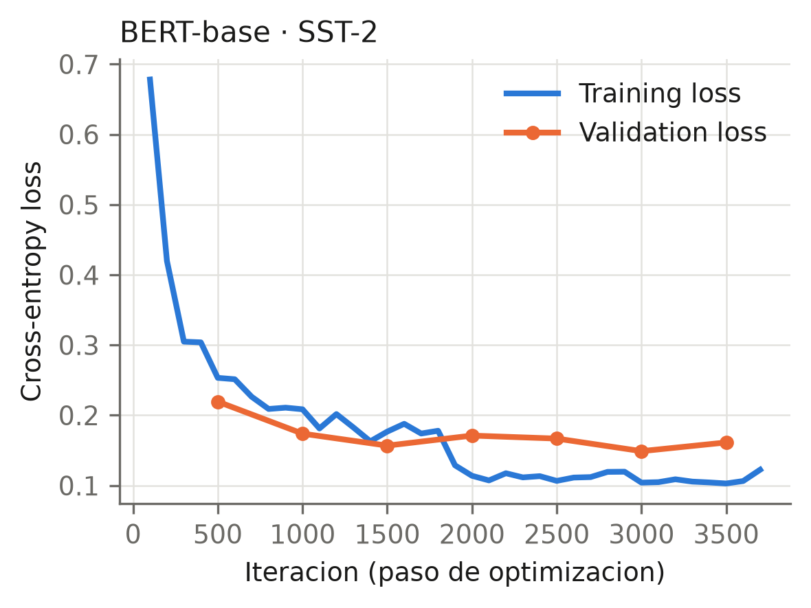
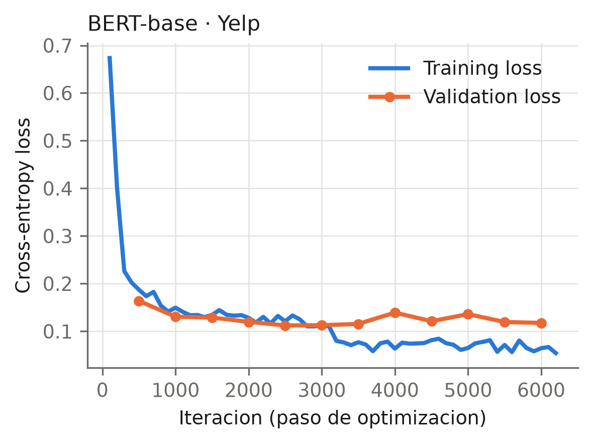
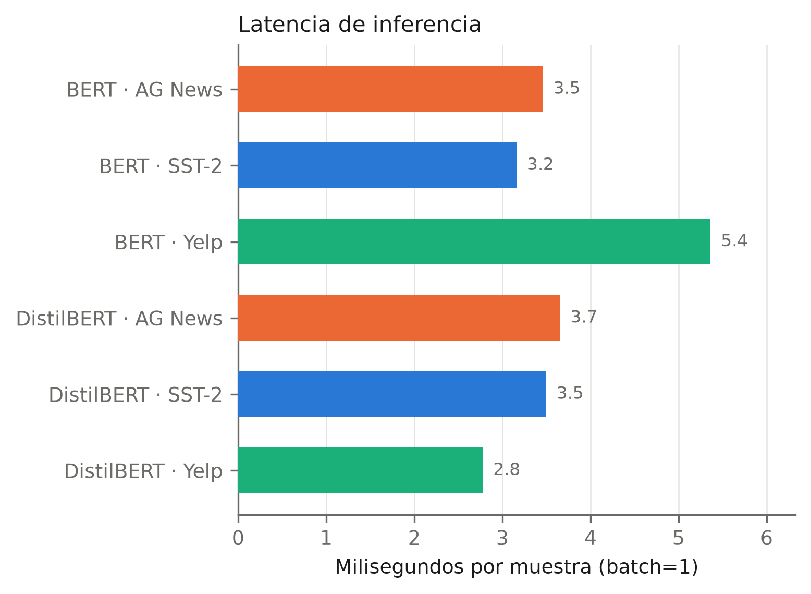
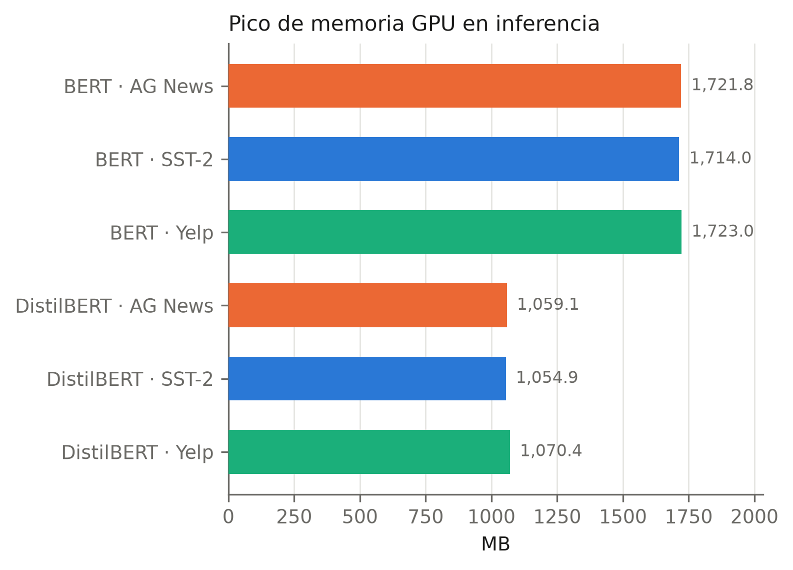
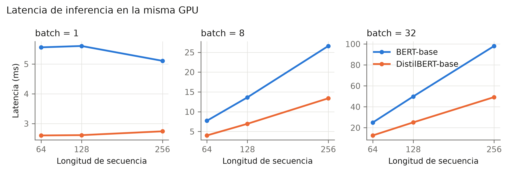

# DistilBERT vs BERT en clasificacion de texto

Proyecto 1 del curso de NLP. Se hace fine-tuning de **BERT-base** y
**DistilBERT-base** sobre tres datasets de clasificacion de texto (SST-2,
AG News y Yelp Polarity), se comparan en desempeno y en eficiencia, y se
estudia con un *ablation study* que partes del modelo importan realmente.


Con el 61 % de los parametros de BERT, DistilBERT conserva entre el 98,9 % y
el 99,5 % de su accuracy y responde el doble de rapido.

## Idea del repositorio

Un solo pipeline sirve para todos los modelos y todos los datasets. Para
lograrlo hay dos piezas de adaptacion:

- `src/data_adapter.py` normaliza los tres datasets a las mismas dos
  columnas (`text`, `label`) y a los mismos tres splits
  (`train` / `validation` / `test`). El resto del codigo no sabe con que
  dataset esta trabajando.
- `src/models.py` construye cualquier modelo a partir de un nombre corto
  (`bert`, `distilbert`) y de los pesos pre-entrenados de HuggingFace.

Asi, cambiar de experimento es cambiar un argumento de la linea de comandos,
y las diferencias que se midan son del modelo y no del codigo.

## Estructura

```
src/
  paths.py          rutas del repo, ancladas a la raiz
  data_adapter.py   carga y normaliza SST-2, AG News y Yelp
  models.py         fabrica de modelos, cabeza configurable y congelado
  train.py          bucle de fine-tuning (escrito a mano, sin Trainer)
  metrics.py        accuracy/precision/recall/F1 + latencia, memoria, tamano
  runs.py           consulta de las corridas guardadas
  style.py          paleta y estilo comun de las figuras
  plots.py          figuras del informe (PDF + PNG)
  tables.py         tablas del informe, en Markdown
  benchmark.py      latencia y memoria en una rejilla controlada
scripts/
  train.sbatch      lanza un fine-tuning en un nodo GPU (Slurm)
  ablation.sbatch   las N configuraciones del ablation, en serie
  benchmark.sbatch  la medicion de eficiencia controlada
  launch_base.sh    los tres datasets de un modelo, de una vez
results/
  metrics/          un JSON por corrida (no se sobrescribe nada)
  figures/          figuras y tablas generadas por src/plots.py
  logs/             salida de los jobs de Slurm
docs/
  papers/           articulos de referencia
  informe/          informe en LaTeX (main.pdf es el entregable)
requirements.txt    dependencias (torch aparte: depende de la CUDA local)
```

## Datasets

| Dataset | Fuente (HuggingFace) | Clases | Train / Val / Test | `max_length` |
|---|---|---|---|---|
| SST-2 | `nyu-mll/glue`, config `sst2` | 2 | 60.614 / 6.735 / 872 | 64 |
| AG News | `fancyzhx/ag_news` | 4 | 108.000 / 12.000 / 7.600 | 128 |
| Yelp Polarity | `fancyzhx/yelp_polarity` | 2 | 100.000\* / 20.000\* / 38.000 | 256 |

Dos decisiones que conviene tener presentes al leer los resultados:

- **El `test` de SST-2 no se usa.** En GLUE viene sin etiquetas (`label = -1`),
  porque la evaluacion es en servidor. Se usa el `validation` oficial (872
  frases) como test, y un 10 % del train como validacion. Es el protocolo
  habitual en la literatura, y por eso los numeros son comparables con los
  publicados.
- **Yelp va submuestreado** (\*): 100k de las 560k resenas de train y 20k de
  validacion. Entrenar con las 560k a 256 tokens multiplicaria por cinco el
  costo para mover la accuracy decimas, y el mismo presupuesto se aplica a los
  dos modelos, que es lo que hace justa la comparacion.

## Instalacion

```bash
conda create -y -n nlp-p1 python=3.11
conda activate nlp-p1
pip install torch --index-url https://download.pytorch.org/whl/cu128   # ver nota
pip install -r requirements.txt
```

`torch` va aparte a proposito: la rueda depende de la version de CUDA de la
maquina y pip no la resuelve solo. En CPU basta con `pip install torch`.

Para **solo regenerar las figuras y las tablas** desde los JSON que ya estan
en el repo no hace falta ni GPU ni torch:

```bash
pip install matplotlib numpy
python -m src.plots
```

Los datasets y los checkpoints se descargan solos la primera vez. Si se
entrena en un cluster cuyos nodos de calculo no tienen internet, hay que
bajarlos antes desde el nodo de login:

```bash
python -c "
from datasets import load_dataset
from transformers import AutoTokenizer, AutoModelForSequenceClassification
for hf_id, cfg in [('nyu-mll/glue','sst2'), ('fancyzhx/ag_news',None), ('fancyzhx/yelp_polarity',None)]:
    load_dataset(hf_id, cfg, cache_dir='data/raw')
for mid in ['distilbert-base-uncased','bert-base-uncased']:
    AutoTokenizer.from_pretrained(mid); AutoModelForSequenceClassification.from_pretrained(mid, num_labels=2)
"
```

## Uso

### Fine-tuning

```bash
# Un experimento concreto
python -m src.train --model distilbert --task sst2 --epochs 2 --tag base

# Yelp: se submuestrea para acotar el costo
python -m src.train --model distilbert --task yelp \
    --max-train 100000 --max-val 20000 --epochs 2 --tag base
```

Argumentos utiles: `--batch-size`, `--lr`, `--max-length`, `--log-every`,
`--eval-every`, `--no-amp` (desactiva fp16), `--tag` (etiqueta la corrida).
Cada ejecucion escribe `results/metrics/<modelo>_<tarea>[_<tag>]_<fecha>.json`
con todas las metricas, la configuracion y el historial de loss. Nunca se
sobrescribe una corrida anterior.

**Convencion de etiquetas.** Como nada se borra, la etiqueta es lo unico que
distingue una corrida del informe de una prueba. Las figuras y las tablas
descartan `smoke` y `pilot` (ver `TAGS_DESCARTADOS` en `src/runs.py`):

| Tag | Que es |
|---|---|
| `base` | corrida del informe, protocolo completo |
| `abl-<config>` | una configuracion del ablation study |
| `smoke` | prueba rapida de que el pipeline arranca |
| `pilot` | exploratoria, con el train submuestreado |

Conviene respetarla: una corrida exploratoria etiquetada como si fuera
definitiva acaba en el informe sin que nadie lo note.

### En un cluster con Slurm

```bash
sbatch scripts/train.sbatch --model distilbert --task sst2 --epochs 2 --tag base
bash scripts/launch_base.sh distilbert     # los tres datasets de una vez
```

### Figuras y tablas

```bash
python -m src.plots               # results/figures/
python -m src.runs                # tabla resumen de todas las corridas
```

Cada figura se escribe en **PDF** (vectorial, para el informe) y en **PNG**
(que es lo que GitHub renderiza dentro de este README). Se regeneran desde
los JSON que ya estan versionados en `results/metrics/`, asi que no hacen
falta ni GPU ni torch: basta `pip install matplotlib numpy`.

## Protocolo de entrenamiento

Identico para los dos modelos, que es la condicion para que la comparacion
signifique algo:

| | |
|---|---|
| Optimizador | AdamW, `lr = 2e-5`, `weight_decay = 0.01` (sin decay en bias ni LayerNorm) |
| Scheduler | warmup lineal 10 % + decaimiento lineal |
| Epocas / batch | 2 / 32 |
| Precision | fp16 (AMP) |
| Clipping | norma maxima 1.0 |
| Seleccion | se conserva el checkpoint con mejor F1 de **validacion**; el test se toca una sola vez |
| Semilla | 42 en Python, NumPy y PyTorch |

Las metricas de eficiencia (latencia y memoria) se miden todas en la misma
GPU (NVIDIA RTX A6000), con warm-up previo y `torch.cuda.synchronize()`:
sin sincronizar se estaria midiendo el tiempo de encolar la operacion, no el
de ejecutarla.

Las curvas de loss de las seis corridas base estan en `results/figures/`.
Dos ejemplos, el dataset mas facil y el mas dificil:

| SST-2 | Yelp |
|---|---|
|  |  |

## Ablation study

Solo sobre DistilBERT. Se cambian la cabeza de clasificacion y que parte del
transformer se entrena, dejando todo lo demas fijo. Seis configuraciones, cada
una en los tres datasets (18 corridas):

| Config | Cabeza | Encoder | Que eje prueba |
|---|---|---|---|
| `lineal` | 768 → C | entrenable | menos capas (ninguna oculta) |
| `h128` | 768 → 128 → C | entrenable | menos neuronas |
| `h768` | 768 → 768 → C | entrenable | referencia |
| `h2048` | 768 → 2048 → C | entrenable | mas neuronas |
| `c2` | 768 → 512 → 256 → C | entrenable | mas capas |
| `frz` | 768 → 768 → C | **congelado** | congelar el transformer |

```bash
sbatch scripts/ablation.sbatch                  # las 6 configuraciones x 3 datasets
CONFIGS=4 sbatch scripts/ablation.sbatch        # version corta
TAREAS="sst2" sbatch scripts/ablation.sbatch    # un solo dataset
```

Es **un solo job de Slurm** que ejecuta las corridas en serie. La QOS
`a-pregrado` permite una GPU a la vez y 3 jobs encolados, asi que enviar 18
jobs seria rechazado y de todos modos correrian uno detras de otro.

En modo ablation el modelo es *encoder desnudo + cabeza propia*
(`ClasificadorConCabeza` en `src/models.py`), identica para BERT y para
DistilBERT. Se hace asi a proposito: la cabeza por defecto de HuggingFace es
distinta en cada arquitectura (BERT pasa por el pooler con `tanh`, DistilBERT
por `pre_classifier` con `ReLU`), y comparar cabezas montadas sobre dos
preprocesos distintos mezclaria dos variables en el mismo experimento.

El congelado se entrena con `lr 1e-3` en vez de `2e-5`. Ese learning rate esta
pensado para ajustar pesos ya pre-entrenados; la cabeza de un encoder
congelado se aprende desde cero y con 2e-5 apenas avanzaria, asi que perderia
por el learning rate y no por estar congelada, que es lo que se quiere medir.

### Resultado del ablation

La configuracion se elige por **F1 de validacion** promediado sobre los tres
datasets. El test no participa en la eleccion: se mira una sola vez, al final.

| Config | SST-2 | AG News | Yelp | **Media** | Params entrenables | Tiempo |
|---|---|---|---|---|---|---|
| **`lineal`** | 0,9483 | 0,9462 | 0,9603 | **0,9516** | 66,4 M | 15,3 min |
| `h2048` | 0,9470 | 0,9459 | 0,9601 | 0,9510 | 67,9 M | 16,3 min |
| `h128` | 0,9480 | 0,9454 | 0,9593 | 0,9509 | 66,5 M | 15,9 min |
| `c2` | 0,9476 | 0,9434 | 0,9604 | 0,9505 | 66,9 M | 15,9 min |
| `h768` | 0,9485 | 0,9427 | 0,9596 | 0,9503 | 67,0 M | 16,3 min |
| `frz` | 0,8574 | 0,9084 | 0,9005 | 0,8887 | 0,6 M | 6,0 min |


Lo que dice el estudio, en dos frases:

1. **La cabeza casi no importa.** Las cinco configuraciones con el encoder
   entrenable caben en 0,0014 de F1: un clasificador lineal iguala a un MLP de
   2048 neuronas y a uno de dos capas ocultas. Con 6.735 a 56.000 ejemplos de
   validacion segun el dataset, esas diferencias estan dentro del ruido.
2. **Congelar el transformer si importa, y cuanto depende de la tarea.** El
   encoder congelado pierde 8,4 puntos de F1 en SST-2, 5,8 en Yelp y solo 3,4
   en AG News. Clasificar temas de noticias se resuelve casi con las
   caracteristicas que DistilBERT ya trae de fabrica; detectar sentimiento en
   frases cortas con negacion y sarcasmo exige que el encoder se adapte.

Gana `lineal`, pero no porque sea mejor: queda empatada con las demas dentro
del ruido y es la mas pequena y la mas rapida de entrenar. Ante un empate, la
configuracion mas simple es la eleccion defendible.

### La mejor configuracion, ahora con BERT

`lineal` (cabeza `Linear(768 → C)`, encoder entrenable) aplicada a los dos
modelos, mismo protocolo, mismos datos:

| Dataset | Modelo | Accuracy | Precision | Recall | F1 | F1 val | Params | Tiempo |
|---|---|---|---|---|---|---|---|---|
| SST-2 | BERT | **0,9289** | 0,9294 | 0,9286 | 0,9288 | 0,9541 | 109,5 M | 4,2 min |
| SST-2 | DistilBERT | 0,9094 | 0,9099 | 0,9091 | 0,9093 | 0,9483 | 66,4 M | 1,7 min |
| AG News | BERT | **0,9453** | 0,9456 | 0,9453 | 0,9453 | 0,9481 | 109,5 M | 9,0 min |
| AG News | DistilBERT | 0,9442 | 0,9443 | 0,9442 | 0,9442 | 0,9462 | 66,4 M | 5,4 min |
| Yelp | BERT | **0,9653** | 0,9653 | 0,9653 | 0,9653 | 0,9661 | 109,5 M | 16,0 min |
| Yelp | DistilBERT | 0,9610 | 0,9610 | 0,9610 | 0,9610 | 0,9603 | 66,4 M | 8,2 min |

Con la cabeza lineal BERT gana en los tres datasets, por 1,95 puntos en SST-2,
0,43 en Yelp y 0,11 en AG News. Es el mismo patron de las corridas base: la
distancia entre los dos modelos depende de la tarea, y se estrecha casi hasta
desaparecer en clasificacion de temas.

Un detalle que conviene mirar: la cabeza lineal mejora a BERT respecto de su
propia corrida base (92,89 frente a 92,32 en SST-2), que usa la cabeza por
defecto de HuggingFace -- pooler con `tanh` y dropout. Es decir, el
preprocesado extra de esa cabeza no aporta nada en estas tareas, y en SST-2
incluso estorba.

### Reproducir todo

```bash
bash scripts/launch_base.sh distilbert    # 3 corridas base
bash scripts/launch_base.sh bert          # 3 corridas base
CONFIGS=6 sbatch scripts/ablation.sbatch  # 18 corridas del ablation
MODELO=bert CONFIGS=mejor MEJOR="lineal|--head-hidden none" \
    sbatch scripts/ablation.sbatch        # 3 corridas de la ganadora con BERT
sbatch scripts/benchmark.sbatch           # latencia y memoria controladas
python -m src.plots                       # figuras y tablas
```

24 corridas en total, unas 2,5 horas de GPU en una RTX A6000, en serie porque
la QOS permite una GPU a la vez.

## Resultados

### Desempeno (test)

Mismo protocolo para los dos modelos: 2 epocas, batch 32, lr 2e-5, fp16, en
una RTX A6000. Precision, recall y F1 son macro-promedio.

| Dataset | Modelo | Accuracy | Precision | Recall | F1 | Entrenamiento |
|---|---|---|---|---|---|---|
| SST-2 | BERT-base | **0,9232** | 0,9232 | 0,9231 | 0,9231 | 4,2 min |
| SST-2 | DistilBERT-base | 0,9128 | 0,9134 | 0,9125 | 0,9127 | 2,7 min |
| AG News | BERT-base | 0,9441 | 0,9443 | 0,9441 | 0,9441 | 9,1 min |
| AG News | DistilBERT-base | **0,9450** | 0,9452 | 0,9450 | 0,9450 | 5,5 min |
| Yelp | BERT-base | **0,9652** | 0,9652 | 0,9652 | 0,9652 | 16,0 min |
| Yelp | DistilBERT-base | 0,9606 | 0,9606 | 0,9606 | 0,9606 | 8,2 min |

DistilBERT conserva el 98,9 % de la accuracy de BERT en SST-2 y el 99,5 % en
Yelp, con un 61 % de los parametros. En AG News la diferencia cambia de signo
(+0,09 puntos para DistilBERT), pero sobre 7.600 ejemplos de test eso son 7
ejemplos: lo honesto es leerlo como un empate, no como una victoria. La
lectura razonable es que clasificar temas de noticias no necesita las 6 capas
adicionales, mientras que el analisis de sentimiento de SST-2 -- frases cortas,
con negaciones y sarcasmo -- si las aprovecha.

Los tres valores de DistilBERT caen donde caen los publicados (SST-2 91,3),
lo que indica que el protocolo esta bien calibrado y no hay fugas entre splits.

### Eficiencia

| | BERT-base | DistilBERT-base |
|---|---|---|
| Parametros | 109,5 M | 67,0 M (−39 %) |
| Tamano en fp32 | 417,7 MB | 255,4 MB (−39 %) |
| Capas transformer | 12 | 6 |
| Memoria GPU en inferencia | ~1.720 MB | ~1.060 MB (−38 %) |
| Tiempo de entrenamiento | 29,3 min (3 datasets) | 16,4 min (−44 %) |

| Latencia por corrida | Memoria GPU |
|---|---|
|  |  |

**La latencia hay que medirla aparte.** El campo `latencia_ms_media` que
guarda cada corrida se mide con la longitud de secuencia de SU dataset y justo
al terminar ese entrenamiento, asi que esos numeros no son comparables entre
si: BERT en SST-2 marca 3,16 ms y DistilBERT en SST-2 marca 3,50 ms, es decir,
el modelo del doble de capas saldria "mas rapido". Para la tabla del informe se
usa `src/benchmark.py`, que mide los dos modelos en la misma rejilla de
(batch, longitud), en la misma GPU y en el mismo proceso:

```bash
sbatch scripts/benchmark.sbatch      # o: python -m src.benchmark
```

### Latencia controlada (RTX A6000, fp32)

| Batch × Longitud | BERT | DistilBERT | Aceleracion | Memoria |
|---|---|---|---|---|
| 1 × 64 | 5,56 ms | 2,60 ms | 2,14× | 0,62× |
| 1 × 256 | 5,11 ms | 2,74 ms | 1,86× | 0,63× |
| 8 × 128 | 13,62 ms | 6,95 ms | 1,96× | 0,65× |
| 32 × 64 | 24,97 ms | 12,62 ms | 1,98× | 0,67× |
| 32 × 256 | 98,10 ms | 49,25 ms | 1,99× | 0,77× |

Medido asi, DistilBERT es **2× mas rapido** en los nueve puntos de la rejilla,
que es exactamente lo que predice pasar de 12 capas a 6. En rendimiento, con
batch 32 y 64 tokens: 2.535 frente a 1.282 muestras por segundo.



Esta figura muestra ademas por que los numeros por corrida no servian: **con batch = 1 la latencia es plana** respecto
a la longitud de secuencia (BERT 5,56 / 5,61 / 5,11 ms para 64 / 128 / 256
tokens; DistilBERT 2,60 / 2,61 / 2,74). Multiplicar por cuatro la longitud no
cuesta nada porque la GPU no esta calculando, esta esperando a que se lancen
los kernels. Solo a partir de batch 8 la latencia empieza a seguir a la
longitud, que es cuando la medida significa algo. La conclusion practica: la
ventaja de DistilBERT se cobra igual en los dos regimenes, pero por motivos
distintos -- menos kernels que lanzar cuando se sirve de a una peticion, y la
mitad de calculo cuando se procesa en lote.

## Informe

El informe completo esta en [`docs/informe/`](docs/informe/), en LaTeX, y el
PDF compilado en [`docs/informe/main.pdf`](docs/informe/main.pdf). Cubre la
metodologia (incluido el tratamiento de los pesos pre-entrenados), los
resultados, el ablation study, la eficiencia, las limitaciones y un apendice
de reproducibilidad.

```bash
brew install tectonic     # una vez
cd docs/informe && make   # genera main.pdf
```

Las figuras no se copian dentro del informe: se leen de `results/figures/` en
su version PDF, asi que el documento no puede quedar desincronizado del
pipeline.

## Referencias

- Devlin et al. (2019). *BERT: Pre-training of Deep Bidirectional Transformers
  for Language Understanding.* NAACL. (`docs/papers/`)
- Sanh et al. (2019). *DistilBERT, a distilled version of BERT: smaller,
  faster, cheaper and lighter.* NeurIPS EMC^2 Workshop.
